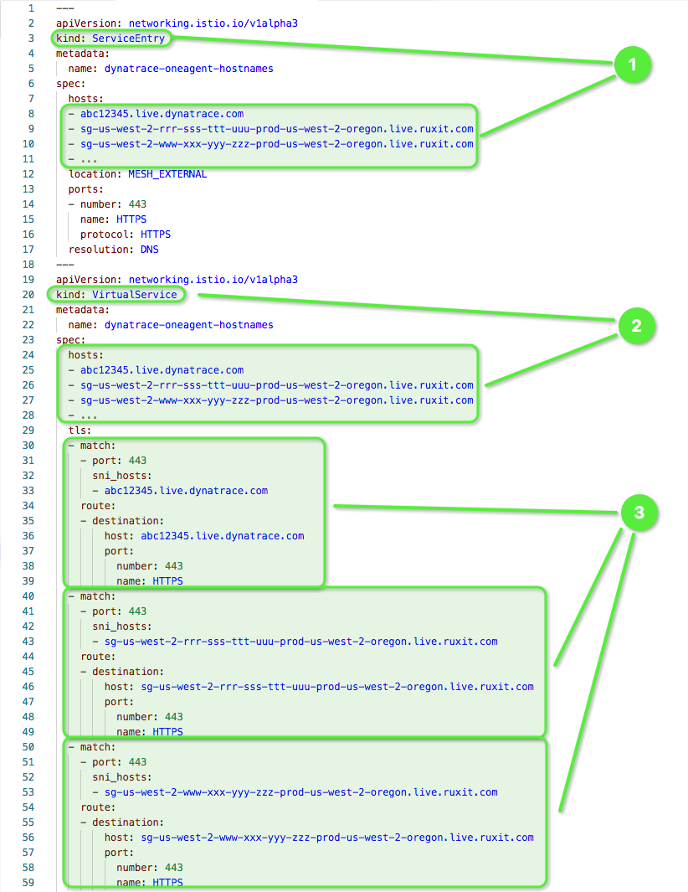

1. Last but not least, we need to configure `ServiceEntry`s for the Dynatrace OneAgent, so the language specific components that run inside the pods can communicate with the Dynatrace servers. To do that, at first make a GET call to the REST endpoint of your Dynatrace environment. Replace the _environmentId_ with your environment ID and the _paas-token_ with the PaaS token you've created earlier during the Monitoring-as-a-Service session.

    ```
    (bastion)$ curl https://{environmentID}.live.dynatrace.com/api/v1/deployment/installer/agent/connectioninfo?Api-Token={paas-token}
    ```

    The output you get will loke something like this. The list of `communcationEndpoints` is what we need in the next step.

    ```
    {
        "tenantUUID": "abc12345", (your environment ID)
        "tenantToken": "ABCDEF1234567890",
        "communicationEndpoints": [
            "https://sg-us-west-2-rrr-sss-ttt-uuu-prod-us-west-2-oregon.live.ruxit.com/communication",
            "https://sg-us-west-2-www-xxx-yyy-zzz-prod-us-west-2-oregon.live.ruxit.com/communication",
            ...
        ]
    }
    ```

    In the `k8s-deploy-production` repository, open the file `istio/service_entry_oneagent.yml` and edit the contents so that all `communicationEndpoints` from the previous are listed in that file. Make sure that you 
    * enter all `communicationEndpoints` in the `ServiceEntry` :one:, 
    * enter all `communicationEndpoints` in the `VirtualService` :two:,
    * make sure that a `tls-match` entry exists for each `communicationEndpoint` :three:

    

    After editing the file, apply the configuration.

    ```
    (bastion)$ pwd
    ~/repositories/k8s-deploy-production
    (bastion)$ kubectl apply -f istio/service_entry_oneagent.yml
    ```

---

[Previous Step: Install Istio](../1_Install_Istio) :arrow_backward: :arrow_forward: [Next Step: Deploy to Production](../3_Deploy_to_production)

:arrow_up_small: [Back to overview](../)
