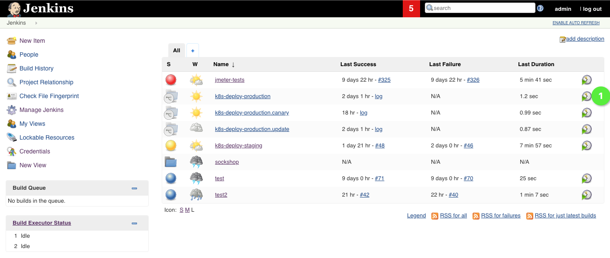

# Deploy to Production

In this lab, we'll promote all components that are currently in the `staging` namespace to the production namespace.

## Steps

1. In your Jenkins instance, trigger the `k8s-deploy-production` pipeline :one:.

    

    This pipeline reads the current versions of all artefacts in the `staging` namespace and deploys those artefacts in the exact same version to the `production` namespace. Instead of pushing individual microservices to production, we chose the approach of defining a release bracket, that holds versions of microservices that work together well.

    Naturally, we dispatch a deployment event to all affected services. This might not work for the first deployment, because the service might not exist as a Dynatrace entity when dispatching the event, but it will work for all consecutive calls.

---

[Previous Step: Configure Istio Components](../2_Configure_istio_components) :arrow_backward: :arrow_forward: [Next Step: Create front-end v2](../4_Create_front-end_v2)

:arrow_up_small: [Back to overview](../)
